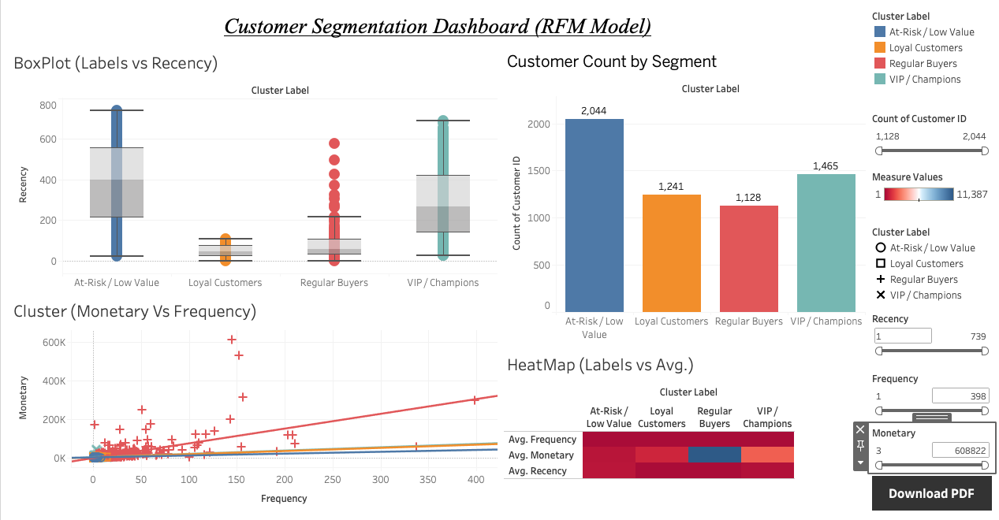

# Customer Segmentation using RFM Analysis and K-Means Clustering

## 📌 Project Overview
This project focuses on segmenting customers based on their purchasing behavior using the **RFM (Recency, Frequency, Monetary)** model combined with **K-Means clustering**. The goal is to identify meaningful customer groups that can be leveraged for targeted marketing, customer retention, and revenue optimization.

The project demonstrates a complete end-to-end data analytics workflow, from data cleaning and feature engineering to clustering, visualization, and dashboarding.

---

## 📂 Dataset
- **Source:** Online Retail II Dataset  
- **Provider:** UCI Machine Learning Repository / Kaggle  
- **Description:** Transaction-level data for an online retail store including invoices, customer IDs, purchase dates, quantities, and prices.

---

## 🛠️ Tools & Technologies
- **Python (Google Colab)**
  - Pandas, NumPy
  - Scikit-learn
  - Matplotlib, Seaborn
- **Tableau**
  - Interactive dashboards for business insights
- **Excel**
  - Initial exploration and validation

---

## 🔄 Project Workflow

### 1️⃣ Data Cleaning & Preprocessing
- Removed cancelled transactions and invalid records
- Handled missing `Customer ID` values
- Created a `TotalPrice` feature
- Filtered out non-positive monetary values

---

### 2️⃣ RFM Feature Engineering
- **Recency:** Days since last purchase
- **Frequency:** Number of unique invoices per customer
- **Monetary:** Total spend per customer

---

### 3️⃣ Data Transformation
- Applied **log transformation** to handle skewness
- Standardized RFM features using **StandardScaler**

---

### 4️⃣ Customer Segmentation
- Applied **K-Means clustering**
- Determined optimal number of clusters using the **Elbow Method**
- Assigned cluster labels to each customer

---

### 5️⃣ Cluster Interpretation
Identified four meaningful customer segments:

| Segment | Description |
|-------|-------------|
| VIP / Champions | High frequency, high spend, recent buyers |
| Loyal Customers | Regular repeat buyers with good monetary value |
| Regular Buyers | Moderate engagement with high variability |
| At-Risk / Low Value | Infrequent and inactive customers |

---

### 6️⃣ Visualization & Analysis
- Pairplots and boxplots (log-transformed RFM)
- Cluster-wise scatter plots (Monetary vs Frequency)
- Heatmap of average RFM values per segment

---

### 7️⃣ Tableau Dashboard
An interactive Tableau dashboard was created to visualize:
- Customer count per segment
- RFM distributions by segment
- Monetary vs Frequency behavior
- Segment-wise RFM heatmap

### Outcome
The dashboard serves as a decision-support tool for marketing and business teams, helping identify:
- High-value customers for retention and loyalty programs  
- Regular buyers suitable for upsell and engagement strategies  
- At-risk customers requiring reactivation campaigns  

This output bridges the gap between data science modeling and real-world business action.

---

## 📊 Key Insights
- VIP customers form a smaller segment but contribute disproportionately to revenue
- Regular Buyers show high behavioral variability, making them ideal for targeted conversion strategies
- At-Risk customers represent the largest segment and require re-engagement campaigns

---

## 📁 Outputs
- `customer_segments_export.csv` – Clustered customer data
- Tableau Dashboard (PDF / Tableau Public)
- Visual analytics and summary tables

---

## 🚀 Business Use Cases
- Targeted marketing campaigns
- Customer retention and loyalty programs
- Revenue optimization strategies
- Personalized product recommendations

---

## 📌 Conclusion
This project highlights how behavioral data and unsupervised learning can be effectively used to drive business decisions. By combining RFM analysis with clustering and visualization, businesses can gain actionable insights into their customer base and optimize marketing strategies accordingly.

---
